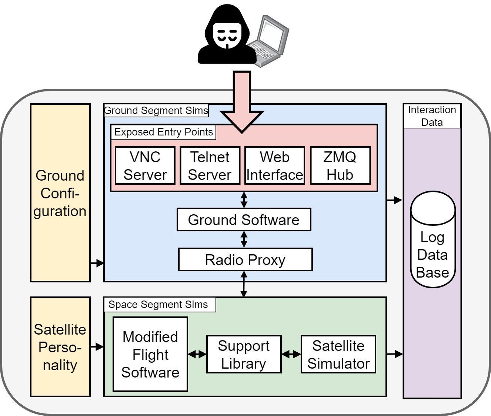

# HoneySat's Satellite Simulator



## Getting Started

### Dependencies

> IMPORTANT: Python <3.13 is required

```bash
python -m venv env
source env/bin/activate
pip install -r requirements.txt
```

Download the igrf14coeffs.txt file from:  https://www.ngdc.noaa.gov/IAGA/vmod/coeffs/igrf14coeffs.txt
and place it in `env/lib/<PYTHON-VERSION>/site-packages/pyIGRF/src/igrf14coeffs.txt`

```shell
mkdir -p <PYTHON_PATH>/site-packages/pyIGRF/src/
cp assets/igrf14coeffs.txt <PYTHON_PATH>/site-packages/pyIGRF/src/igrf14coeffs.txt
```

<!-- Env Variables -->
### :key: Environment Variables

To run this project, you will need to add the following environment variables to your .env file

```
MONGO_DB_NAME
MONGO_USER_NAME
MONGO_PASSWORD
MONGO_IP
MONGO_PORT
GROUND_STATION_LAT
GROUND_STATION_LON
SATELLITE_NAME_TLE
SATELLITE_NORAD_CATALOG_NUMBER
```

### Run

```bash
source .env
python main.py
```


<!-- Research Paper -->
### :scroll: Research Paper

**HoneySat: A Network-based Satellite Honeypot Framework** 

If you use our work in a scientific publication, please do cite us using this **BibTex** entry:
``` tex
@inproceedings{placeholder,
  title={HoneySat: A Network-based Satellite Honeypot Framework},
  author={placeholder},
  booktitle={placeholder},
  year= {placeholder}
}
```

<!-- License -->
## :warning: License

Distributed under the MIT License. See LICENSE.txt for more information.


<!-- Acknowledgments -->
## :gem: Acknowledgements

Use this section to mention useful resources and libraries that you have used in your projects.

 - [PyBaMM](https://github.com/pybamm-team/PyBaMM)
 - [Skyfield](https://github.com/skyfielders/python-skyfield)
 - [PyZMQ](https://github.com/zeromq/pyzmq)

# Instrucciones para ejecución del código para Laboratorio 2
## 1. Clonar el repositorio
```bash
git clone https://github.com/valenpy22/apr-lab-2.git
cd apr-lab-2
```

## 2. Crear un entorno conda
```bash
conda create --name nuevo_entorno python=3.10
conda activate nuevo_entorno
```

## 3. Instalar las dependencias
```bash
conda install -c conda-forge stable-baselines3 gymnasium optuna matplotlib pyzmq python-dotenv pyIGRF pymongo pillow
pip install pybamm skyfield numpy scipy gym gymnasium
conda install -c conda-forge tensorboard  # Opcional, solo si deseas usar TensorBoard
```

## 4. Usar las variables de entorno
```bash
source set_env.sh
```

## 5. Ejecutar el código
```bash
python train_deep_rl_dqn.py

```

## 6. Monitoreo del entrenamiento
```bash
Using cpu device
-----------------------------------------
| time/                   |             |
|    fps                  | 1335        |
|    iterations           | 25          |
|    time_elapsed         | 38          |
|    total_timesteps      | 51200       |
| train/                  |             |
|    approx_kl            | 0.004337039 |
|    clip_fraction        | 0.0359      |
|    clip_range           | 0.2         |
|    entropy_loss         | -0.49       |
|    explained_variance   | 0.0798254   |
|    learning_rate        | 0.0003      |
|    loss                 | 0.0162      |
|    n_updates            | 240         |
|    policy_gradient_loss | -0.00465    |
|    value_loss           | 0.0179      |
-----------------------------------------

```

## 7. Evaluación del modelo
```bash
python evaluate_model.py

```

## 8. Guardado de modelos
El modelo entrenado se guardará automáticamente en la carpeta models en formato .zip. Puedes cargar el modelo más tarde usando Stable Baselines3 para hacer más evaluaciones o continuar el entrenamiento.
